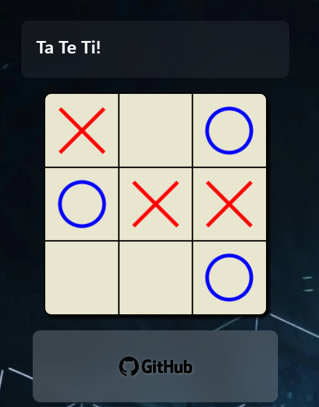

# Juego del TATETI
## Esta es una práctica de javascript realizando una versión del juego del Tateti
### Este juego se debe usar por turnos y se juega de a dos personas.

Puedes probarla en mi Portafolio:[ir](https://leogidev.free.nf/Practicas/Tateti/)